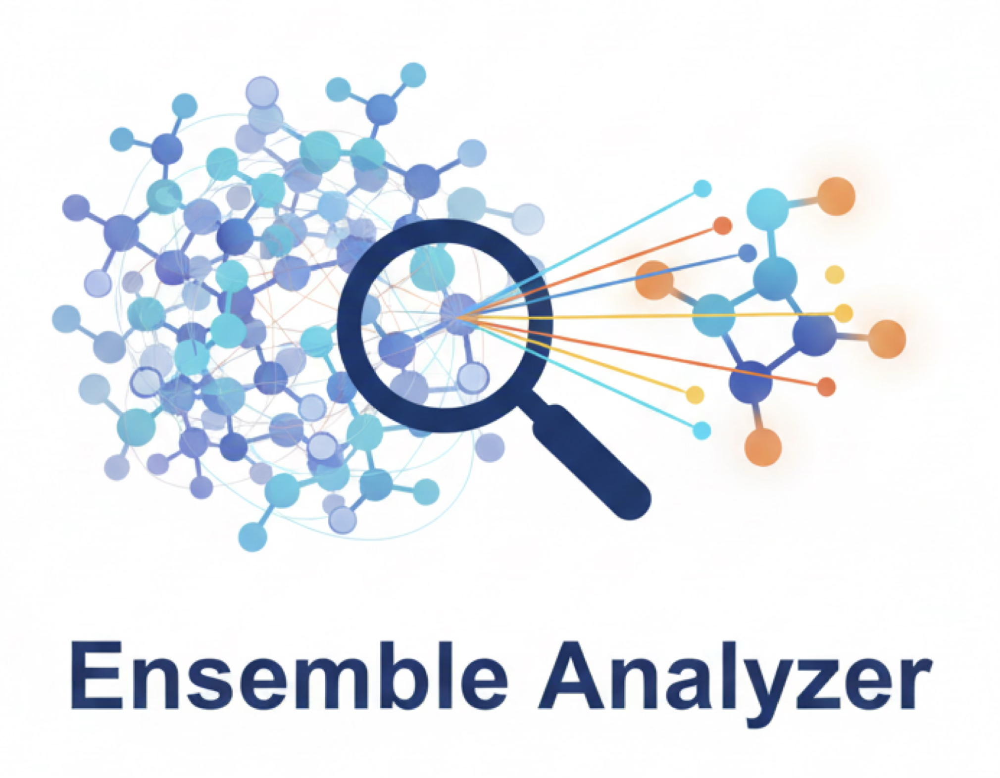

# Ensemble Analyzer 
[](https://www.python.org/downloads/)
[](LICENSE)

## Conformer Ensemble Pruning Software

**Ensemble Analysis** (**EnAn**) is a Python framework for automated conformational analysis and ensemble processing in computational chemistry workflows.

---

## 🎯 Key Features

### Core Capabilities
- ⚡ **Multi-Protocol Workflows**: Sequential optimization/frequency calculations with automatic pruning
- 🔬 **Quantum Chemistry Integration**: Support for ORCA, Gaussian, semi-empirical (TBLite), and ML potentials (AIMNet)
- 📊 **Advanced Clustering**: PCA-based conformer clustering with multiple feature extraction methods
- 🎨 **Spectral Analysis**: Generate weighted IR, VCD, UV-vis, and ECD spectra
- 🔄 **Checkpoint System**: Automatic restart capability with atomic file operations

### Analysis Tools
- **Thermochemistry**: Grimme's qRRHO implementation for every integration
- **Clustering Method**: Distance matrix eigenvalues (rotation/translation invariant).
- **Pruning**: Intelligent energy-based filtering with Boltzmann weighting


---

## 📦 Installation

### Requirements
- **Python** ≥ 3.11
- **Core**: NumPy, SciPy, Matplotlib, ASE
- **Clustering**: scikit-learn
- **Acceleration**: Numba

```bash
# Base install (ORCA/Gaussian only)
pip install ensemble-analyzer

# With ML potentials (TBLite, AIMNet)

```bash
pip install "ensemble-analyzer[aimnet]"
```

### External QM Programs (optional)

| Program | Requirement | Env Var |
|---------|-------------|---------|
| [ORCA](https://orcaforum.kofo.mpg.de/app.php/portal) | Installed binary | `ORCAVERSION="x.y.z"` |
| [Gaussian](https://gaussian.com) | Licensed installation | — |

### Semi-empirical & ML Potentials (optional)

| Calculator | Type | Extra | Model Weights |
|------------|------|-------|---------------|
| **TBLite** | Semi-empirical (GFN-xTB) | `[tblite]` | Built-in |
| **AIMNet** | ML potential | `[aimnet]` | `ENAN_MODELS_DIR/aimnet/` |


Point to your model weights directory:
```bash
export ENAN_MODELS_DIR="/path/to/ml_weights"
# Default: ~/.ensemble_analyzer/models/<calculator>/
```

## 🚀 Quick Start

### 1. Define your protocol file
Create `protocol.json`
```json
{
    "0": {"funcional": "r2SCAN-3c", "opt": true, "freq": true,"cluster": 5, "comment": "Initial Optimization cluster into 5 families"},
    "1": {"funcional": "wB97X-D4rev", "basis": "def2-QZVPPD", "comment": "Single Point energy evaluation"}
}

```

### 2. Basic Usage
```bash
ensemble_analyzer --ensemble conformers.xyz --protocol protocol.json --output calculation.out --cpu 8 --temperature 298.15
```

### 3. Using Semi-empirical & ML Potentials
```json
{
    "0": {"calculator": "tblite", "functional": "GFN2-xTB", "opt": true, "freq": true},
    "1": {"calculator": "aimnet", "functional": "aimnet2", "cluster": 10},
}
```

ML calculators skip file I/O and parsing — energies are read directly from ASE atoms.

### 4. Restart from Checkpoint
```bash
# Automatically resumes from last completed protocol
ensemble_analyzer --restart
```

### CPU Budget

`--cpu <N>` sets the **total CPU budget**. Single-point (SP) calculations are parallelised across conformers; the budget is auto-split:

| `--cpu` | per-job CPUs (QM) | parallel workers |
|---------|-------------------|------------------|
| 32      | 8                 | 4                |
| 16      | 8                 | 2                |
| 8       | 8                 | 1 (serial)       |
| 4       | 4                 | 1 (serial)       |

- **Opt/Freq** always run **sequentially** with all CPUs allocated to one job.
- **ML calculators** ignore per-job CPU; all workers run in parallel.
- Output files are written directly into `conf_N/protocol_M/` (no file-moving step).

---

### Protocol Parameters

| Parameter | Type | Description | Example |
|-----------|------|-------------|---------|
| **Calculation Settings** ||||
| `functional` | str | DFT functional or method | `"B3LYP"`, `"xtb"`, `"HF-3c"` |
| `basis` | str | Basis set (auto for composite methods) | `"def2-SVP"`, `"def2-TZVP"` |
| `calculator` | str | QM program / ML potential | `"orca"` (default), `"gaussian"`, `"tblite"`, `"aimnet"` |
| `opt` | bool | Optimize geometry | `true`, `false` |
| `freq` | bool | Calculate frequencies | `true`, `false` |
| `mult` | int | Spin multiplicity | `1` (singlet), `2` (doublet) |
| `charge` | int | Molecular charge | |
| **Pruning Thresholds** ||||
| `thrG` | float | Energy similarity threshold [kcal/mol] | `3.0`, `5.0` |
| `thrB` | float | Rotatory constant threshold [cm⁻¹] | `30.0`, `50.0` |
| `thrGMAX` | float | Energy window cutoff [kcal/mol] | `10.0` |
| `cluster` | bool/int | Enable clustering | `true` (auto), `5` (fixed) |
| `no_prune` | bool | Disable pruning | `false` (default) |
| **Advanced** ||||
| `solvent` | dict | Implicit solvation | `{"solvent": "water", "model": "SMD"}` |
| `constrains` | list | Geometry constraints (only on cartesians)| `[1,2]` (fix cartesians) |
| `monitor_internals` | list | Track bond/angle/dihedral | `[[0,1], [0,1,2]]` |
| `skip_opt_fail` | bool | Skip failed optimizations | `false` (default) |
| `block_on_retention_rate` | bool | Block the calculation has a retention rate lower than the `MIN_RETENTION_RATE` (20%) | `false` (default) |

---

## Standalone CLI applications

### Protocol Wizard

If you don't want to create from scratch the protocol file, the `enan_protocol_wizard` is an automatic and interactive way to create this essential file. 
It is divided into three different level of configuration: i) basic, where all the essential parameters are asked, ii) intermediate, and iii) advance. 
Feel free to browse all the possible protocol options and parameters.

### Regrapher

If you want to change the convolution of your graphs, you can edit the setting.json file. Here, all the global settings are present. When finished, the command `enan_regraph` come handy. It re-run the Graph workflow with these new setting and in few time, you'll have your new graphs.
```bash
usage: enan_regraph [-h] [-rb READ_BOLTZ] [-no-nm] [-w] [--disable-color] idx [idx ...]

positional arguments:
  idx                   Protocol's number to (re-)generate the graphs

options:
  -h, --help            show this help message and exit
  -rb READ_BOLTZ, --read-boltz READ_BOLTZ
                        Read Boltzmann population from a specific protocol
  -no-nm, --no-nm       Do not save the nm graphs
  -w, --weight          Show Weighting function
  --disable-color       Disable colored output
```

### Graph Editor

All graphs are saved also as a pickle. This file can be reloaded and from there you can modify every single element of the Matplotlib Figure store in it. This requires some programming skills and, especially, time. Here is where `enan_graph_editor` comes to play. It is once again an interactive terminal interface (based both on rich or InquierPy library) where you can change and personalize every pickle. If you have to modify more files at once, a *batch* mode is implemented as well, so to by-pass the limitation of the manual selection of the interactive TUI. 

```bash
usage: enan_graph_editor [-h] [--batch] [--list] [--rename OLD NEW] [--rename-file RENAME_FILE] [--color LABEL COLOR] [--linestyle LABEL STYLE] [--linewidth LABEL WIDTH] [--alpha LABEL ALPHA] [--output OUTPUT] [--format {pickle,png,pdf,svg}] [--preview] [--no-strict]
                         [--verbose]
                         pickle_file

Interactive/batch editor for matplotlib pickles

positional arguments:
  pickle_file           Matplotlib pickle file

options:
  -h, --help            show this help message and exit
  --batch, -b           Batch mode (non-interactive)
  --no-strict           Disable strict validation
  --verbose, -v         Verbose output

batch mode options:
  --list, -l            List labels and exit
  --rename OLD NEW, -r OLD NEW
                        Rename label
  --rename-file RENAME_FILE, -rf RENAME_FILE
                        Mapping file OLD=NEW
  --color LABEL COLOR, -c LABEL COLOR
                        Change colour
  --linestyle LABEL STYLE, -ls LABEL STYLE
                        Change line linestyle (e.g., -, --, :, -. )
  --linewidth LABEL WIDTH, -lw LABEL WIDTH
                        Change line linewidth (float)
  --alpha LABEL ALPHA, -a LABEL ALPHA
                        Change line transparency (0-1)
  --output OUTPUT, -o OUTPUT
                        Output file
  --format {pickle,png,pdf,svg}, -f {pickle,png,pdf,svg}
                        Output format
                        
DEFAULT MODE: Interactive TUI
  python enan_graph_editor plot.pkl

BATCH MODE (examples):
  python enan_graph_editor plot.pkl --batch --list
  python enan_graph_editor plot.pkl --batch --rename "Protocol 1" "Proto A"
  python enan_graph_editor plot.pkl --batch --color "Experimental" red --output new.pkl
```

---
## 🤝 Contributing

### Development Workflow
```bash
# Fork and clone
git clone https://github.com/andre-cloud/ensemble_analyzer.git
cd ensemble_analyzer

# Create feature branch
git checkout -b feature/awesome-feature

# Install dev dependencies
pip install -e .

# Commit and push
git commit -m "Add awesome feature"
git push origin feature/awesome-feature
```
---

## 📄 License

This software is licensed under the MIT-3.0 License. See the LICENSE file for details.

## 📞 Support and contact

For any questions or support, please contact [by email](mailto:andrea.pellegrini15@unibo.it,paolo.righi@unibo.it).
