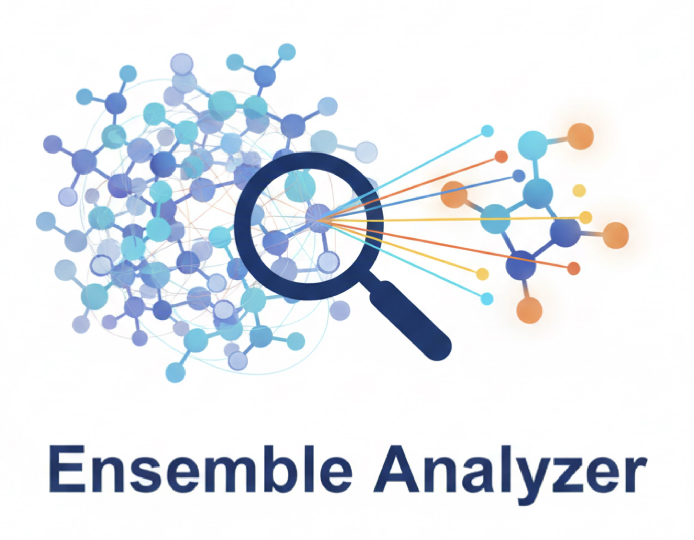

Ensemble Analyzer Documentation
===============================

.. **EnAn** è un framework Python per l'analisi conformazionale automatizzata e l'elaborazione di ensemble in flussi di lavoro di chimica computazionale.

.. toctree::
   :maxdepth: 2
   :caption: User Guide

   .. installation.md
   .. user_guide/workflow.md
   .. user_guide/cli_tools.md

.. toctree::
   :maxdepth: 2
   :caption: Scientific Background

   theory.md

.. toctree::
   :maxdepth: 2
   :caption: API Reference

   api_reference.rst

Indices and tables
==================

* :ref:`genindex`
* :ref:`modindex`